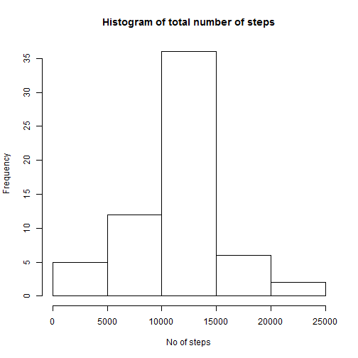

Reading the file


```r
steps <- read.csv("activity.csv")
stepsmod <- steps[complete.cases(steps),]
```

Calculating the total number of steps per day


```r
library(dplyr)
stepstotal <- stepsmod %>% group_by(date) %>% summarise_each(funs(sum))
stepstotal
```

```
## Source: local data frame [53 x 3]
## 
##          date steps interval
## 1  2012-10-02   126   339120
## 2  2012-10-03 11352   339120
## 3  2012-10-04 12116   339120
## 4  2012-10-05 13294   339120
## 5  2012-10-06 15420   339120
## 6  2012-10-07 11015   339120
## 7  2012-10-09 12811   339120
## 8  2012-10-10  9900   339120
## 9  2012-10-11 10304   339120
## 10 2012-10-12 17382   339120
## ..        ...   ...      ...
```

Histogram of total number of steps per day


```r
hist(stepstotal$steps, main = "Histogram of total number of steps", xlab="No of steps", ylab = "Frequency")
```

 

Mean and median for the total number of steps per day


```r
stepsmean <- stepsmod %>% group_by(date) %>% summarise_each(funs(mean))
stepsmean
```

```
## Source: local data frame [53 x 3]
## 
##          date    steps interval
## 1  2012-10-02  0.43750   1177.5
## 2  2012-10-03 39.41667   1177.5
## 3  2012-10-04 42.06944   1177.5
## 4  2012-10-05 46.15972   1177.5
## 5  2012-10-06 53.54167   1177.5
## 6  2012-10-07 38.24653   1177.5
## 7  2012-10-09 44.48264   1177.5
## 8  2012-10-10 34.37500   1177.5
## 9  2012-10-11 35.77778   1177.5
## 10 2012-10-12 60.35417   1177.5
## ..        ...      ...      ...
```

```r
stepsmedian <- stepsmod %>% group_by(date) %>% summarise_each(funs(median))
stepsmedian
```

```
## Source: local data frame [53 x 3]
## 
##          date steps interval
## 1  2012-10-02     0   1177.5
## 2  2012-10-03     0   1177.5
## 3  2012-10-04     0   1177.5
## 4  2012-10-05     0   1177.5
## 5  2012-10-06     0   1177.5
## 6  2012-10-07     0   1177.5
## 7  2012-10-09     0   1177.5
## 8  2012-10-10     0   1177.5
## 9  2012-10-11     0   1177.5
## 10 2012-10-12     0   1177.5
## ..        ...   ...      ...
```
5-minute inetrval plot


```r
stepsmean2 <- stepsmod %>% group_by(interval) %>% summarise_each(funs(mean))
plot(stepsmean2$interval,stepsmean2$steps,type = "l", xlab = "5-minute interval", ylab = "Average number of steps taken")
```

 


Calculating the number of NAs


```r
na <- sum(is.na(steps$steps))
```

Total number of rows with NAs is 2304

Replacing NAs with mean


```r
steps[is.na(steps)] <- mean(stepsmod$steps)
```

Creating histogram and calculating mean and median for the new dataset


```r
stepstotal2 <- steps %>% group_by(date) %>% summarise_each(funs(sum))

hist(stepstotal2$steps, main = "Histogram of total number of steps", xlab="No of steps", ylab = "Frequency")
```

 

```r
stepsmean2 <- steps %>% group_by(date) %>% summarise_each(funs(mean))
stepsmean2
```

```
## Source: local data frame [61 x 3]
## 
##          date    steps interval
## 1  2012-10-01 37.38260   1177.5
## 2  2012-10-02  0.43750   1177.5
## 3  2012-10-03 39.41667   1177.5
## 4  2012-10-04 42.06944   1177.5
## 5  2012-10-05 46.15972   1177.5
## 6  2012-10-06 53.54167   1177.5
## 7  2012-10-07 38.24653   1177.5
## 8  2012-10-08 37.38260   1177.5
## 9  2012-10-09 44.48264   1177.5
## 10 2012-10-10 34.37500   1177.5
## ..        ...      ...      ...
```

```r
stepsmedian2 <- steps %>% group_by(date) %>% summarise_each(funs(median))
stepsmedian2
```

```
## Source: local data frame [61 x 3]
## 
##          date   steps interval
## 1  2012-10-01 37.3826   1177.5
## 2  2012-10-02  0.0000   1177.5
## 3  2012-10-03  0.0000   1177.5
## 4  2012-10-04  0.0000   1177.5
## 5  2012-10-05  0.0000   1177.5
## 6  2012-10-06  0.0000   1177.5
## 7  2012-10-07  0.0000   1177.5
## 8  2012-10-08 37.3826   1177.5
## 9  2012-10-09  0.0000   1177.5
## 10 2012-10-10  0.0000   1177.5
## ..        ...     ...      ...
```

Adding weekdays and weekends


```r
library(lubridate)
stepsdays <- mutate(steps,daytype = ifelse(wday(steps$date) == (1 | 7),"Weekend","weekday"))
stepsdays$daytype <- factor(stepsdays$daytype)
```

Plotting by weekdays and weekends


```r
stepsdaysmean <- stepsdays %>% group_by(interval,daytype) %>% summarise_each(funs(mean))

par(mfrow = c(2,1), mar = c(4, 4, 2, 1))
with(subset(stepsdaysmean, daytype == "weekday"), plot(stepsdaysmean$interval,stepsdaysmean$steps, type = "l", main = "Weekday", xlab = "5-minute Interval", ylab = "Average number of steps"))
with(subset(stepsdaysmean, daytype == "weekend"), plot(stepsdaysmean$interval,stepsdaysmean$steps, type = "l", main = "Weekend", xlab = "5-minute Interval", ylab = "Average number of steps"))
```

 
